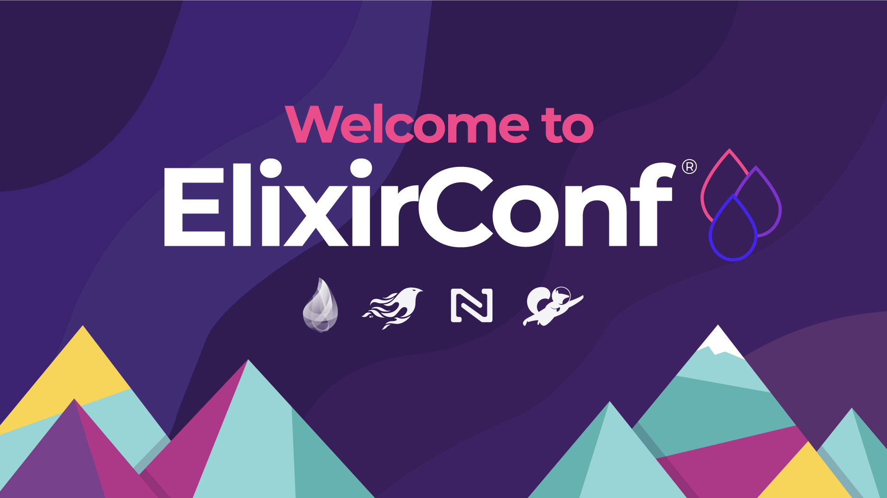
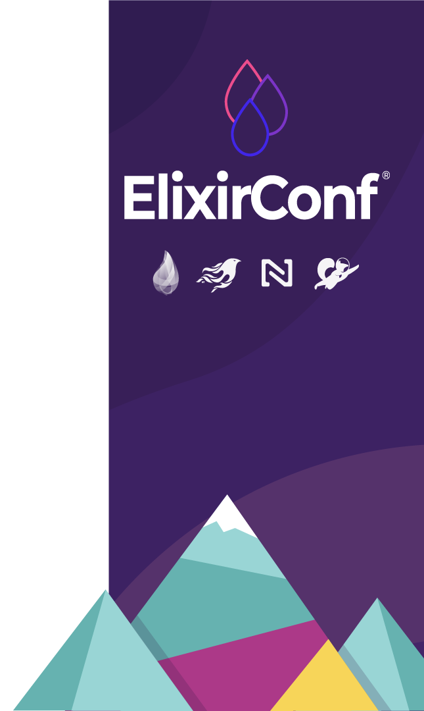

---

# Embedded Apps with LiveState
### Chris Nelson
LaunchScout

---

# Who dis?

---

# What's an Embedded Application?
* Adds functionality to a larger application
* Examples
  * Live support
  * Buy button
  * ??

---

# Current state of the art
* Third party javascript
* Often `iframe` based
* Proprietary, limited customization

---

# There's a better way
* Custom Elements are here
* Supported by all the browsers
* Fully stylable with CSS
* The right tool for the job!

---

# Let's render LiveView in a Custom Element then!
* It's certainly *possible*
* I even got simple examples working
* But things get *really* complicated *really* fast
* In the end, it just didn't feel right (to me)

---

# What's LiveState?
* An elixir library (live_state)
* A javascript library (phx-live-state)
  * Note: not an official Phoenix thing!
  * I just stole the prefix cuz `live-state` npm was taken

---

# The basic ideas of LiveState
* Events
* State
* Reducers: functions which take
  * event
  * current state
  * return a new state

---

# Does this seem familiar?
* `GenServer`
* Redux
* LiveView

---

# Is there a name for this pattern?
* Event/State Reducers?
* Event Driven Thingamajig?
* Action Oriented Stuff?
* You know, the thing where you have functions that take event and current state and return a new state

---

# The new-ish idea
* Taking this pattern multi-tier
* No more request/reponse
* Dispatch events, receive state
  * and possibly other events

---

# Hot take! 
## It isn't javascript that makes client side development terrible
## It's the complexity on managing requests, responses, and state

---

# Let's dig in: `live_state`

* The elixir library
* `use LiveState.Channel` in yo channel
* implement
  * `init/3` to build initial state
  * `handle_event/3` to handle events
    * returns new state
    * optionally dispatches client events
  * optional: `handle_message` for PubSub

---

# Let's make a `TodoChannel`

---

# Introducing `phx-live-state`
* javascript (typescript) npm
* `LiveState` has a lower level API
* `connectElement()` allows you to "wire up" a Custom Element
* more ergonomics to come

---

# LiveState
* `new LiveState(url, channel)`
* `liveState.connect(params)` connects to socket and joins channel
* `liveState.subscribe((state) => {})` pass a function which will be called with new state
* `liveState.pushEvent(new CustomEvent('foo', {detail: ...})`) sends a custom event up to channel using detail as the payload 
  * `handle_event` will be called on channel to compute new state

---

##  `connectElement(element, liveState, options)`
* options:
  * properties - list of properties to set from state
  * attributes - list of attributes to set from state
  * events
    * send - events to send from this element
    * receive - events to receive and then dispatch on this element

---

# Let's make a Todo Element!

---

# More demos
* [Live comments](https://launchscout.github.io/test-livestate-comments/)
* Live commerce

---

# Future possible things
* Very soon:
  * jsonpatch for efficient state management
  * authorization hook and example
* Other clients
  * Swift/iOS
  * Kotlin/Android
  * React
* Connecting to FAAS

---

# It's early times!
* APIs may still change
* It's great time to join us if you want to help them be better :)
* If you are building an embedded or micro front end app, let's talk
  * chris@launchscout.com
